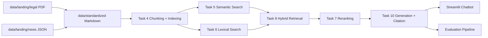

# Báo cáo nhóm - RAG Chatbot pháp luật ma túy

## 1. Thông tin nhóm

| Thành viên | MSSV | Nhánh / phần đóng góp chính | Trạng thái |
| --- | --- | --- | --- |
| Nguyễn Văn Chung | 2A202600647 | Task 1-3: thu thập tài liệu pháp luật, crawl tin tức, chuẩn hóa dữ liệu Markdown | Hoàn thành |
| Vũ Thanh Danh | 2A202600606 | Task 4-6: chunking/indexing, semantic search, lexical search | Hoàn thành |
| Ngô Thanh Tình | 2A202600919 | Task 7-10: reranking, PageIndex/vectorless, retrieval pipeline, generation có citation | Hoàn thành |
| Cao Việt Hoàng | 2A202600779 | Giao diện RAG chatbot bằng Streamlit | Hoàn thành |
| Võ Duy Bảo | 2A202600648 | Evaluation pipeline, golden dataset, báo cáo đánh giá | Hoàn thành |

## 2. Mục tiêu dự án

Nhóm xây dựng một hệ thống RAG Chatbot phục vụ hỏi đáp về pháp luật phòng, chống ma túy và một số tin tức liên quan. Hệ thống cần trả lời dựa trên tài liệu đã truy xuất, có citation, hiển thị nguồn tham khảo và có thể chạy demo bằng giao diện Streamlit.

Sản phẩm cuối gồm:

- Pipeline xử lý dữ liệu từ PDF/JSON sang Markdown chuẩn hóa.
- Pipeline tìm kiếm gồm semantic search, lexical search, hybrid retrieval và reranking.
- Module generation trả lời có citation và hạn chế hallucination.
- Giao diện chatbot để người dùng hỏi đáp trực tiếp.
- Bộ evaluation gồm 15 câu hỏi kiểm thử, script chạy đánh giá và báo cáo kết quả.

## 3. Kiến trúc hệ thống



Luồng xử lý chính:

1. Dữ liệu đầu vào nằm trong `data/landing`, gồm văn bản pháp luật dạng PDF và tin tức dạng JSON.
2. Task 3 chuyển dữ liệu sang Markdown trong `data/standardized`.
3. Task 4 chia tài liệu thành chunks và tạo index.
4. Task 5 và Task 6 thực hiện tìm kiếm semantic và lexical.
5. Task 9 kết hợp kết quả bằng hybrid retrieval, ưu tiên đúng loại tài liệu theo câu hỏi.
6. Task 7 rerank để đưa nguồn liên quan nhất lên đầu.
7. Task 10 sinh câu trả lời có citation, chỉ kết luận dựa trên nguồn truy xuất được.
8. Streamlit hiển thị hội thoại và nguồn tài liệu tham khảo.

## 4. Phân công và kết quả từng thành viên

### 4.1. Nguyễn Văn Chung - 2A202600647

Phụ trách Task 1-3.

Công việc đã làm:

- Thu thập tài liệu pháp luật liên quan đến phòng, chống ma túy.
- Bổ sung các file PDF trong `data/landing/legal`.
- Crawl hoặc chuẩn bị dữ liệu tin tức trong `data/landing/news`.
- Chuẩn hóa tài liệu sang Markdown trong `data/standardized`.

Kết quả đạt được:

- Có dữ liệu pháp luật nền tảng để hệ thống RAG truy xuất.
- Có tài liệu Nghị định 105/2021/NĐ-CP, Nghị định 57/2022/NĐ-CP và Luật Phòng, chống ma túy 2021.
- Dữ liệu đã được chuẩn hóa để các task phía sau có thể chunk, index và search.

### 4.2. Vũ Thanh Danh - 2A202600606

Phụ trách Task 4-6.

Công việc đã làm:

- Xây dựng logic chia tài liệu thành chunks.
- Tạo indexing cho dữ liệu chuẩn hóa.
- Triển khai semantic search để tìm kiếm theo ngữ nghĩa.
- Triển khai lexical search/BM25 để tìm kiếm theo từ khóa chính xác.

Kết quả đạt được:

- Hệ thống có lớp tìm kiếm cơ bản phục vụ retrieval.
- Có thể truy xuất tài liệu theo cả ngữ nghĩa và từ khóa.
- Tạo nền cho hybrid retrieval ở Task 9.

### 4.3. Ngô Thanh Tình - 2A202600919

Phụ trách Task 7-10.

Công việc đã làm:

- Triển khai reranking để sắp xếp lại các chunks theo độ liên quan.
- Xây dựng PageIndex/vectorless retrieval.
- Xây dựng retrieval pipeline kết hợp semantic search, lexical search và reranking.
- Xây dựng generation pipeline trả lời có citation.
- Cải thiện độ chính xác chatbot cho các câu hỏi pháp luật quan trọng.

Kết quả đạt được:

- Chatbot trả lời dựa trên nguồn đã truy xuất thay vì trả lời tự do.
- Với câu hỏi tổng quan về Luật Phòng, chống ma túy và Nghị định 105/2021/NĐ-CP, hệ thống ưu tiên đọc toàn văn tài liệu chuẩn hóa để tóm tắt chính xác hơn.
- Với câu hỏi về mức phạt/tội danh nhưng thiếu nguồn Bộ luật Hình sự, hệ thống không tự bịa con số mà cảnh báo không đủ căn cứ.
- Câu trả lời có citation dạng tên file nguồn.

### 4.4. Cao Việt Hoàng - 2A202600779

Phụ trách giao diện chatbot.

Công việc đã làm:

- Xây dựng giao diện Streamlit cho chatbot.
- Hiển thị khung chat giữa người dùng và trợ lý.
- Hiển thị phần nguồn tài liệu tham khảo.
- Tích hợp UI với hàm generation của pipeline.

Kết quả đạt được:

- Ứng dụng có thể chạy bằng `streamlit run app.py`.
- Người dùng có thể nhập câu hỏi và nhận câu trả lời trực tiếp trên giao diện web.
- Có khu vực mở rộng để xem nguồn tài liệu được dùng.

### 4.5. Võ Duy Bảo - 2A202600648

Phụ trách evaluation.

Công việc đã làm:

- Tạo golden dataset gồm 15 câu hỏi kiểm thử.
- Viết script chạy evaluation trong `group_project/evaluation/eval_pipeline.py`.
- So sánh 2 cấu hình retrieval/generation.
- Viết báo cáo kết quả trong `group_project/evaluation/results.md`.

Kết quả đạt được:

- Có bộ kiểm thử để đánh giá pipeline RAG.
- Có báo cáo các chỉ số Faithfulness, Answer Relevance, Context Recall và Context Precision.
- Có phân tích worst performers và đề xuất hướng cải thiện.

## 5. Các cải thiện mới nhất về độ chính xác

Trong quá trình kiểm thử chatbot, nhóm phát hiện một số câu hỏi tổng quan bị trả lời bằng các đoạn phụ lục hoặc biểu mẫu không phù hợp. Ví dụ câu hỏi “tóm tắt nội dung nghị định 105 năm 2021” từng bị lấy nhầm nội dung “phiếu kết quả xét nghiệm chất ma túy”.

Nhóm đã cập nhật:

- Tăng số lượng ứng viên retrieval trước khi rerank.
- Ưu tiên tài liệu pháp luật khi câu hỏi thuộc miền pháp luật.
- Thêm xử lý riêng cho câu hỏi tổng quan/tóm tắt về Nghị định 105/2021/NĐ-CP.
- Bỏ qua phần phụ lục, biểu mẫu khi người dùng yêu cầu tóm tắt nội dung nghị định.
- Thêm cơ chế trả lời thận trọng khi nguồn hiện có không đủ căn cứ pháp lý.

Ví dụ câu hỏi nên dùng để demo:

```text
tóm tắt nội dung nghị định 105 năm 2021
```

Kết quả mong đợi:

- Chatbot nêu đúng đây là Nghị định số 105/2021/NĐ-CP ban hành ngày 04/12/2021.
- Nêu đúng nội dung chính là quy định chi tiết và hướng dẫn thi hành một số điều của Luật Phòng, chống ma túy.
- Tóm tắt các phần chính như phạm vi điều chỉnh, đối tượng áp dụng, phối hợp cơ quan chuyên trách, kiểm soát hoạt động hợp pháp liên quan đến ma túy, quản lý người sử dụng trái phép chất ma túy, trách nhiệm cơ quan và hiệu lực thi hành.
- Không lấy nhầm phụ lục/biểu mẫu làm nội dung chính.

## 6. Cấu trúc thư mục quan trọng

```text
Day08_RAG_pipeline_cohort2/
├── app.py
├── data/
│   ├── landing/
│   │   ├── legal/
│   │   └── news/
│   └── standardized/
├── src/
│   ├── task1_collect_legal_docs.py
│   ├── task2_crawl_news.py
│   ├── task3_convert_markdown.py
│   ├── task4_chunking_indexing.py
│   ├── task5_semantic_search.py
│   ├── task6_lexical_search.py
│   ├── task7_reranking.py
│   ├── task8_pageindex_vectorless.py
│   ├── task9_retrieval_pipeline.py
│   └── task10_generation.py
├── group_project/
│   ├── README.md
│   ├── demo_notes.md
│   └── evaluation/
│       ├── golden_dataset.json
│       ├── eval_pipeline.py
│       └── results.md
└── tests/
```

## 7. Hướng dẫn cài đặt và chạy chatbot

Cài dependencies:

```powershell
pip install -r requirements.txt
```

Chạy giao diện chatbot:

```powershell
streamlit run app.py
```

Mở trình duyệt tại:

```text
http://localhost:8501
```

Một số câu hỏi demo:

```text
luật về phòng chống ma túy ở VN
```

```text
tóm tắt nội dung nghị định 105 năm 2021
```

```text
Hình phạt cho tội tàng trữ trái phép chất ma túy là gì?
```

Lưu ý: với câu hỏi về hình phạt, nếu hệ thống chưa có nguồn Bộ luật Hình sự tương ứng, chatbot sẽ không tự kết luận mức phạt để tránh trả lời sai.

## 8. Hướng dẫn chạy evaluation

Chạy test tự động:

```powershell
pytest tests/ -v
```

Chạy evaluation nhóm:

```powershell
python group_project/evaluation/eval_pipeline.py
```

Kết quả evaluation được ghi tại:

```text
group_project/evaluation/results.md
```

## 9. Kết quả kiểm thử hiện tại

Kết quả test gần nhất:

```text
35 passed
```

Evaluation pipeline đã chạy được với 15 test cases trong golden dataset. Báo cáo hiện có các nhóm chỉ số:

- Faithfulness.
- Answer Relevance.
- Context Recall.
- Context Precision.
- So sánh A/B giữa cấu hình hybrid + rerank và dense-only.
- Phân tích worst performers và đề xuất cải thiện.

## 10. Kết luận

Nhóm đã hoàn thành sản phẩm RAG Chatbot theo yêu cầu chính:

- Có dữ liệu pháp luật và tin tức đã chuẩn hóa.
- Có retrieval pipeline kết hợp nhiều phương pháp tìm kiếm.
- Có generation trả lời kèm citation.
- Có giao diện chatbot chạy được bằng Streamlit.
- Có evaluation pipeline và báo cáo đánh giá.
- Có phân công rõ ràng cho 5 thành viên, mỗi người phụ trách một phần độc lập và merge lại vào sản phẩm chung.

Hướng cải thiện tiếp theo là bổ sung thêm nguồn Bộ luật Hình sự và các văn bản xử phạt liên quan để chatbot trả lời chính xác hơn các câu hỏi về tội danh, mức phạt và điều khoản hình sự.
