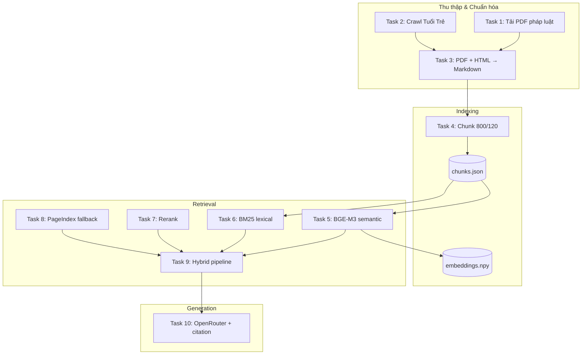

# Báo Cáo Cá Nhân — Nguyễn Văn Chung

**MSSV:** `2A202600647`  
**Repository:** [reimei2009/Day08_RAG_pipeline_cohort2](https://github.com/reimei2009/Day08_RAG_pipeline_cohort2)  
**Nhánh cá nhân:**`2A202600647-NguyenVanChung`  
**Môn:** Ngày 8 — RAG Pipeline v2 (Chương 2)

---

## 1. Tổng Quan

Nguyễn Văn Chung hoàn thành **toàn bộ 10 task bài cá nhân** (RAG pipeline end-to-end) và đóng góp **nhiệm vụ nhóm Task 1–3** (thu thập dữ liệu, crawl báo, chuẩn hóa Markdown) vào thư mục gốc của repository.


| Phạm vi                       | Vị trí trong repo                                           | Trạng thái      |
| ----------------------------- | ----------------------------------------------------------- | --------------- |
| Nhiệm vụ nhóm Task 1–3        | `src/task1–3`, `data/landing/`, `data/standardized/` (root) | Hoàn thành      |
| Bài cá nhân Task 1–10         | `personal_report/2A202600647-NguyenVanChung/`               | Hoàn thành      |
| Bài tập nhóm (chatbot / eval) | `group_project/`                                            | Chưa triển khai |


**Chủ đề dữ liệu:** Pháp luật Việt Nam về ma túy và chất cấm + tin tức nghệ sĩ/diễn viên liên quan ma túy.

**README chi tiết kỹ thuật (tiếng Anh):** `[2A202600647-NguyenVanChung/README.md](2A202600647-NguyenVanChung/README.md)`

---

## 2. Cấu Trúc Repository Liên Quan

```text
Day08_RAG_pipeline_cohort2/
├── README.md                          # Hướng dẫn chung khóa học
├── src/
│   ├── task1_collect_legal_docs.py    # ← Nhóm: validate file pháp luật
│   ├── task2_crawl_news.py            # ← Nhóm: crawl 5 bài Long Nhật
│   └── task3_convert_markdown.py      # ← Nhóm: MarkItDown → Markdown
├── data/
│   ├── landing/
│   │   ├── legal/                     # 3 PDF pháp luật (nhóm)
│   │   └── news/                      # 5 JSON bài báo Long Nhật (nhóm)
│   └── standardized/
│       ├── legal/                     # 3 file .md
│       └── news/                      # 5 file .md
├── personal_report/
│   ├── README.md                      # ← File này (tổng hợp báo cáo)
│   └── 2A202600647-NguyenVanChung/    # Pipeline RAG cá nhân đầy đủ
│       ├── README.md
│       ├── requirements.txt
│       ├── .env.example
│       ├── data/                      # Dataset riêng (Tuổi Trẻ + legal HTML)
│       ├── src/                       # task1.py → task10.py
│       └── tests/                     # (chạy từ thư mục con)
└── group_project/
    └── README.md
```

---

## 3. Nhiệm Vụ Nhóm (Task 1–3) — Đóng Góp Tại Root

Phần nhóm được đẩy lên nhánh `dev` và dùng chung cho cả nhóm. Dữ liệu tin tức tập trung vào **vụ án ca sĩ Long Nhật, Sơn Ngọc Minh, rapper Mr Nhân** (Dân Trí, Thanh Niên).

### Task 1 — Thu thập văn bản pháp luật

**File:** `src/task1_collect_legal_docs.py`


| Văn bản                       | File trong `data/landing/legal/`   |
| ----------------------------- | ---------------------------------- |
| Luật Phòng, chống ma túy 2021 | `luat-phong-chong-ma-tuy-2021.pdf` |
| Nghị định 105/2021/NĐ-CP      | `nghi-dinh-105-2021-nd-cp.pdf`     |
| Nghị định 57/2022/NĐ-CP       | `nghi-dinh-57-2022-nd-cp.pdf`      |


- Script tạo thư mục, liệt kê và **validate** ≥ 3 file PDF/DOCX, mỗi file > 1 KB.
- Chạy: `python src/task1_collect_legal_docs.py`

### Task 2 — Crawl bài báo

**File:** `src/task2_crawl_news.py`


| #   | Nguồn      | Chủ đề                                              |
| --- | ---------- | --------------------------------------------------- |
| 1   | Dân Trí    | Ca sĩ Long Nhật khai chuyện tiền mua ma túy         |
| 2   | Dân Trí    | Lộ diện người cung cấp ma túy cho Long Nhật         |
| 3   | Thanh Niên | Công an TP.HCM bắt Long Nhật và Sơn Ngọc Minh       |
| 4   | Thanh Niên | Ca sĩ Sơn Ngọc Minh vừa bị bắt là ai                |
| 5   | Dân Trí    | Rapper Mr Nhân bị bắt trong đường dây 140 đối tượng |


- Công nghệ: `requests` + `BeautifulSoup` — trích xuất đoạn `<p>` / `<article>`.
- Output JSON: `url`, `title`, `date_crawled`, `content_markdown`.
- Lưu tại: `data/landing/news/article_01` … `article_05`.
- Chạy: `python src/task2_crawl_news.py`

### Task 3 — Convert Markdown

**File:** `src/task3_convert_markdown.py`

- **Pháp luật:** Microsoft **MarkItDown** trên PDF gốc.
- **Tin tức:** Chuyển `content_markdown` từ JSON sang `.md`, kèm YAML frontmatter (title, url, ngày crawl) phục vụ citation.
- Output: `data/standardized/legal/*.md`, `data/standardized/news/*.md`.
- Chạy: `python src/task3_convert_markdown.py`

```powershell
# Kiểm tra Task 1–3 (từ thư mục gốc repo)
pytest tests/test_individual.py::TestTask1 -v
pytest tests/test_individual.py::TestTask2 -v
pytest tests/test_individual.py::TestTask3 -v
```

---

## 4. Bài Cá Nhân (Task 1–10) — Pipeline RAG Đầy Đủ

Thư mục: `personal_report/2A202600647-NguyenVanChung/`

Pipeline cá nhân dùng **bộ dữ liệu riêng** (5 bài Tuổi Trẻ về Hữu Tín, Hải Hiệp Gà, Chí Danh, Hoài Thatcher) và triển khai **đủ 10 module** từ thu thập đến generation có citation.

### 4.1. Kiến trúc hệ thống




### 4.2. Chi tiết từng task


| Task   | Module                          | Công nghệ / Chiến lược                                                        | Output chính                           |
| ------ | ------------------------------- | ----------------------------------------------------------------------------- | -------------------------------------- |
| **1**  | `task1_collect_legal_docs.py`   | `requests` tải PDF từ `datafiles.chinhphu.vn`                                 | `data/landing/legal/*.pdf`             |
| **2**  | `task2_crawl_news.py`           | `requests` + regex title; 5 URL Tuổi Trẻ                                      | `data/landing/news/*.json`             |
| **3**  | `task3_convert_markdown.py`     | PyMuPDF (Luật 73); HTML Thư Viện Pháp Luật (NĐ 105, 57); BeautifulSoup (news) | `data/standardized/**/*.md`            |
| **4**  | `task4_chunking_indexing.py`    | `RecursiveCharacterTextSplitter`, size **800**, overlap **120**               | `data/index/chunks.json` (~875 chunks) |
| **5**  | `task5_semantic_search.py`      | `**BAAI/bge-m3`**, cosine similarity, cache NumPy                             | `data/index/embeddings.npy`            |
| **6**  | `task6_lexical_search.py`       | `**rank_bm25.BM25Okapi`**, token `\w+`                                        | Kết quả BM25 theo query                |
| **7**  | `task7_reranking.py`            | Rerank offline: `0.7×score + 0.3×overlap`, dedupe                             | Top-k đã sắp xếp lại                   |
| **8**  | `task8_pageindex_vectorless.py` | Fallback lexical khi không có API PageIndex                                   | `source: pageindex`                    |
| **9**  | `task9_retrieval_pipeline.py`   | Semantic + BM25 → merge → rerank → threshold → fallback                       | `retrieve(query, top_k)`               |
| **10** | `task10_generation.py`          | **OpenRouter** (`gpt-4o-mini`), trích trực tiếp Điều 5, citation `[Source N]` | `generate_with_citation()`             |


### 4.3. Dữ liệu cá nhân

**Văn bản pháp luật (3):**


| Văn bản                  | Nguồn chuẩn hóa          | Ghi chú                         |
| ------------------------ | ------------------------ | ------------------------------- |
| Luật 73/2021/QH14        | PDF text layer (PyMuPDF) | ~61k ký tự                      |
| Nghị định 105/2021/NĐ-CP | HTML Thư Viện Pháp Luật  | PDF scan — dùng HTML override   |
| Nghị định 57/2022/NĐ-CP  | HTML Thư Viện Pháp Luật  | Danh mục chất ma túy, tiền chất |


**Tin tức (5 bài Tuổi Trẻ):**

1. Nữ diễn viên Hoài Thatcher — mua bán ma túy
2. Diễn viên Hữu Tín — truy tố tổ chức sử dụng ma túy
3. Diễn viên Hữu Tín — án 7 năm 6 tháng tù
4. Diễn viên Hải Hiệp Gà — tàng trữ ma túy
5. Ca sĩ Chí Danh — tổ chức sử dụng ma túy

### 4.4. Điểm kỹ thuật nổi bật

- **HTML override cho Nghị định scan:** PDF ký số không có text layer đủ tốt; dùng HTML từ Thư Viện Pháp Luật, giữ thẻ `<form>` (ASP.NET) để không mất nội dung.
- **Trích xuất trực tiếp Điều 5:** Task 10 nhận diện câu hỏi “hành vi nghiêm cấm” và inject Điều 5 từ file Luật 73, tránh miss retrieval.
- **Phân loại câu hỏi:** Hỗ trợ câu hỏi pháp lý thuần, tàng trữ, tội phạm/án lệ — kết hợp chunk pháp luật + tin tức khi cần.
- **Offline-first:** Rerank và PageIndex fallback chạy được không cần API key; generation dùng OpenRouter khi có key.
- **Báo cáo chuyển đổi:** `data/standardized/pdf_conversion_report.json` ghi chiến lược extract từng file.

### 4.5. Hướng dẫn chạy pipeline cá nhân

```powershell
cd personal_report/2A202600647-NguyenVanChung

py -3.12 -m venv .venv
.\.venv\Scripts\Activate.ps1
python -m pip install -r requirements.txt
python -m pip install requests beautifulsoup4 lxml pymupdf pypdf

copy .env.example .env
# Điền OPENROUTER_API_KEY vào .env

python src/task1_collect_legal_docs.py
python src/task2_crawl_news.py
python src/task3_convert_markdown.py
python src/task4_chunking_indexing.py

pytest tests/test_individual.py -v
python -m src.task10_generation
```

**Kết quả kỳ vọng:** `35 passed` (pytest toàn bộ task cá nhân).

**Câu hỏi demo:**

```text
Điều 5 Luật Phòng, chống ma túy quy định các hành vi bị nghiêm cấm nào?
```

---

## 5. So Sánh Nhóm vs Cá Nhân


| Tiêu chí          | Root (nhóm Task 1–3)              | Personal report                               |
| ----------------- | --------------------------------- | --------------------------------------------- |
| Tin tức           | Long Nhật, Sơn Ngọc Minh, Mr Nhân | Hữu Tín, Hải Hiệp Gà, Chí Danh, Hoài Thatcher |
| Nguồn báo         | Dân Trí, Thanh Niên               | Tuổi Trẻ                                      |
| Convert pháp luật | MarkItDown trên PDF               | PyMuPDF + HTML override cho PDF scan          |
| Crawl format      | `content_markdown` sạch           | Raw `html` + BeautifulSoup                    |
| Task 4–10         | Chưa triển khai tại root          | Đầy đủ trong thư mục cá nhân                  |
| Vector store      | —                                 | `chunks.json` + `embeddings.npy` (file-based) |
| LLM               | —                                 | OpenRouter `gpt-4o-mini`                      |


---

## 6. Trạng Thái & Hạn Chế

### Đã hoàn thành

- Nhiệm vụ nhóm Task 1–3 (data + code tại root)
- Bài cá nhân Task 1–10
- 35 automated tests (chạy từ thư mục `2A202600647-NguyenVanChung/`)
- Push lên GitHub (`dev`, `2A202600647-NguyenVanChung`, `nguyenvanchung`)

### Chưa hoàn thành / Hạn chế

- Bài tập nhóm: RAG Chatbot hoặc Evaluation pipeline (`group_project/`)
- Weaviate chưa dùng — index lưu file JSON/NumPy thay vì vector DB
- PageIndex SDK thật chưa tích hợp — dùng lexical fallback
- `reorder_for_llm` (lost-in-the-middle) chưa áp dụng pattern đảo thứ tự
- Root `src/task4–6` vẫn là stub — pytest root chưa chạy full pipeline

---

## 7. Phân Công Trong Nhóm


| Thành viên           | MSSV            | Nhiệm vụ                             | Trạng thái |
| -------------------- | --------------- | ------------------------------------ | ---------- |
| **Nguyễn Văn Chung** | **2A202600647** | Nhóm Task 1–3; Bài cá nhân Task 1–10 | Hoàn thành |
|                      |                 |                                      |            |
|                      |                 |                                      |            |


---

## 8. Liên Kết

- Repo: [https://github.com/reimei2009/Day08_RAG_pipeline_cohort2](https://github.com/reimei2009/Day08_RAG_pipeline_cohort2)  
- Nhánh dev (nhóm): [https://github.com/reimei2009/Day08_RAG_pipeline_cohort2/tree/dev](https://github.com/reimei2009/Day08_RAG_pipeline_cohort2/tree/dev)  
- Nhánh cá nhân: [https://github.com/reimei2009/Day08_RAG_pipeline_cohort2/tree/2A202600647-NguyenVanChung](https://github.com/reimei2009/Day08_RAG_pipeline_cohort2/tree/2A202600647-NguyenVanChung)  
- README kỹ thuật đầy đủ: `[2A202600647-NguyenVanChung/README.md](2A202600647-NguyenVanChung/README.md)`

